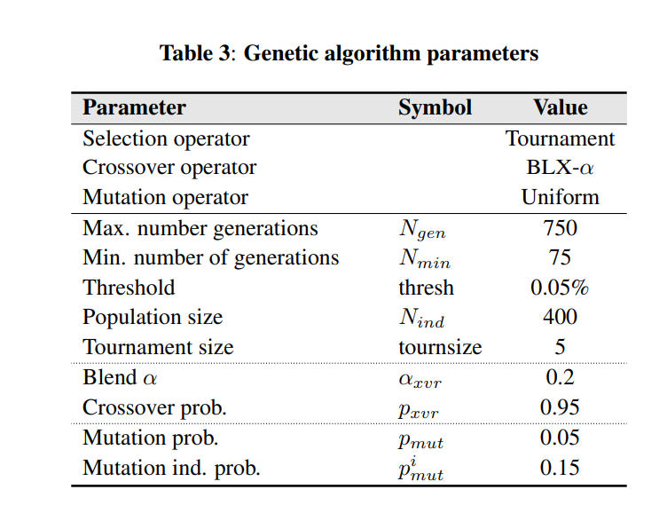

## Genetic Algorithm 

Initially, the genetic algorithm creates new individuals by assigning random values of power and
bandwidth – within a certain range – to the beams (every attribute of an individual
is a power and bandwidth allocation for a beam) and evaluates these individuals.
Then, the following process is executed iteratively: for each generation, the population is selected, crossover and mutation are applied and the individuals changed are
evaluated (fitness is invalidated if the individual was applied crossover or mutation).
There are two termination conditions for the algorithm:

1. Reaching 𝑛𝑔𝑒𝑛 generations. A maximum number of generations sets an upper limit in the algorithm’s execution time, needed to obtain solutions in a timely manner.

2. Reaching 𝑛𝑚𝑖𝑛 generations and having an improvement of less than threshold between two consecutive solutions in the last three generations. This convergence criteria is needed so the algorithm is unbiased in determining when to stop in different demand scenarios. Moreover, there are cases in which the USC might increase slightly and decrease in the following generation, so a window of three generations is a better approach than just considering the difference between two generations. Furthermore, a minimum number of generations 𝑛𝑚𝑖𝑛 should be set to help the algorithm reach better solutions.




```python
# install python packages
!pip install deap

```

    Requirement already satisfied: deap in c:\programdata\anaconda3\lib\site-packages (1.3.1)
    Requirement already satisfied: numpy in c:\programdata\anaconda3\lib\site-packages (from deap) (1.19.2)
    


```python
# import all required packages
import random

from deap import base
from deap import creator
from deap import tools
from deap import gp
```


```python
# geet randomly geneerated power and beam
def random_value():
    return (random.random(),random.uniform(500, 10000))
```


```python
def evaluate(ind):
    𝑖𝑛𝑑 = constraint_handling(𝑖𝑛𝑑)
    𝑠𝑎𝑡 = Satellite(𝑖𝑛𝑑)
    𝑠𝑎𝑡.𝑟𝑢𝑛_𝑙𝑖𝑛𝑘_𝑏𝑢𝑑𝑔𝑒𝑡()
    return USC(𝑠𝑎𝑡)
```


```python
Nind = 400 # Population Size
creator.create("FitnessMin", base.Fitness, weights=(-1.0, -1.0))
creator.create("Individual", list, fitness=creator.FitnessMin)

toolbox = base.Toolbox()

# (p, b) allocations of power and bandwidth to every beam in the satellite)
toolbox.register("attribute", random_value)
toolbox.register("individual", tools.initRepeat, creator.Individual,
                 toolbox.attribute, n=Nind)
toolbox.register("population", tools.initRepeat, list, toolbox.individual)
toolbox.register("evaluate", evaluate)
toolbox.register("crossover", tools.cxBlend)
toolbox.register("mutate", gp.mutUniform) # change me
toolbox.register("select", tools.selTournament, tournsize=5)
```


```python
def crossover_blend(offspring):
    for child1, child2 in zip(offspring[::2], offspring[1::2]):
    if random.random() < CXPB:
        toolbox.crossover(child1[0], child2[0], Axvr)
        del child1.fitness.values
        del child2.fitness.values
```


```python
def mutation(offspring):
    for mutant in offspring:
        if random.random() < MUTPB:
            toolbox.mutate(mutant[0])
            del mutant.fitness.values
```


```python
Ngen = 750
Nmin = 75
thresh = 0.05 # threshold in percentage
Axvr = 0.2 # Blend alpha
def main():
    pop = toolbox.population(n=300)
    
    # Evaluate the entire population
    fitnesses = list(map(toolbox.evaluate, pop))
    for ind, fit in zip(pop, fitnesses):
        ind.fitness.values = fit
    
    # CXPB  is the probability with which two individuals are crossed
    # MUTPB is the probability for mutating an individual
    
    CXPB, MUTPB = 0.95, 0.15
    
    # Extracting all the fitnesses of 
    fits = [ind.fitness.values[0] for ind in pop]
    
    # Variable keeping track of the number of generations
    gen = 0
    
    while gen < Ngen:
        # A new generation
        g = g + 1
        print("-- Generation %i --" % g)
        
        # Select the next generation individuals
        offspring = toolbox.select(pop, len(pop))
        # Clone the selected individuals
        offspring = list(map(toolbox.clone, offspring))
        
        # Apply crossover and mutation on the offspring
        crossover_blend(offspring)
        mutation(offspring)
                
        # Evaluate the individuals with an invalid fitness
        invalid_ind = [ind for ind in offspring if not ind.fitness.valid]
        fitnesses = map(toolbox.evaluate, invalid_ind)
        for ind, fit in zip(invalid_ind, fitnesses):
            ind.fitness.values = fit
            
        pop[:] = offspring
        
        if gen > Nmin then:
            min_1 = min_USC(gen)
            min_2 = min_USC(gen - 1)
            min_3 = min_USC(gen - 2)
            improv_1 = max(min_2 - min_1)/min_2
            improv_2 = max(min_3 - min_2)/min_3
            
            if improv_1 < thresh and improv_2 < thresh:
                break
                
    best = pop[np.argmin([toolbox.evaluate(x) for x in pop])]
    return best
        
```
